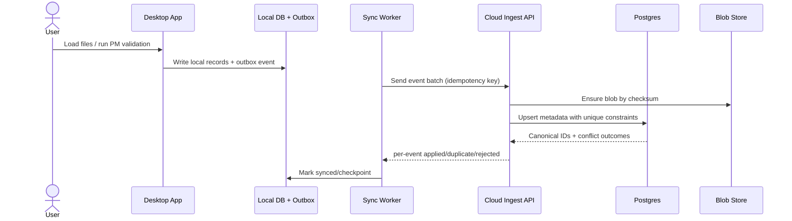
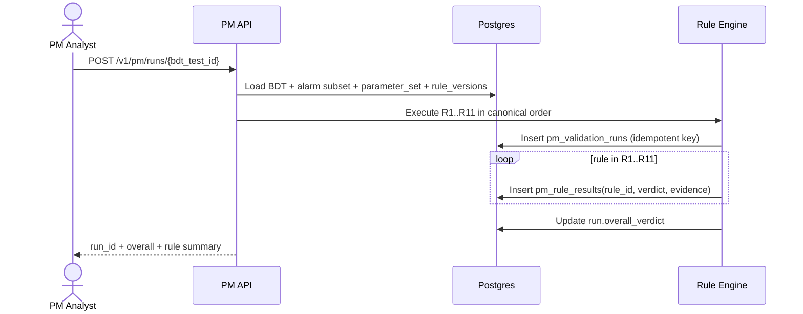
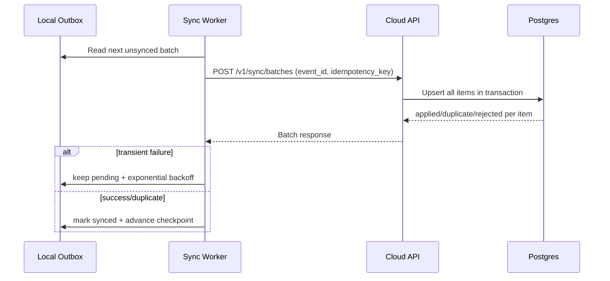

# Product Requirements Document (PRD)
# Deduplication, ORM Persistence, PM Rule Engine, and Local-to-Cloud Migration

## Document Control

| Field | Value |
|---|---|
| Status | Draft for implementation |
| Product | Alarm Viewer (desktop-first) |
| Primary Repo | `alarm_app` |
| Related Modules | `parsers.py`, `viewer.py`, `state.py`, `bdt_parser.py`, `bdt_validator.py`, `bdt_history.py`, `bdt_export.py` |
| Source of truth for this PRD | This file |
| Implementation model | Multi-squad / multi-subagent execution |

---

## 1. Executive Summary

Alarm Viewer must evolve from local-only, in-memory/file-based persistence into a **durable, centralized, deduplicated platform** while preserving current desktop UX and PM validation behavior.

This PRD defines:
1. **Hard duplicate prevention** (file, row, image, PM-run idempotency).
2. **Centralized Postgres + blob storage** design.
3. **Deterministic persisted PM rule engine** for R1-R11.
4. **Local-first, resumable migration/sync** from each app instance to cloud.
5. **Execution plan by team of subagents/squads** with acceptance gates.

---

## 2. Problem Statement and Business Context

Current system behavior is operational but not enough for scaled governance:
- Alarm ingestion parses files in parallel and concatenates in memory without ingest dedup guarantees.
- Local persistence uses `state.json`, `data_cache.parquet`, and JSON history files.
- PM validation (R1-R11) runs in-process and is not persisted as versioned, auditable runs.

Business impact:
1. **Duplicate inflation risk** across users/devices/uploads.
2. **Auditability risk** for PM verdict reproducibility.
3. **Migration risk** if cloud transition requires manual user re-uploads or causes workflow disruption.

This PRD solves those risks with deterministic identities, DB constraints, and local-first sync.

---

## 3. Goals and Non-Goals

## 3.1 Goals

1. Preserve current desktop workflows during rollout.
2. Guarantee idempotent dedup at cloud persistence layer.
3. Persist PM validation with rule/version/parameter/evidence provenance.
4. Support automatic, resumable local-to-cloud migration without manual bulk re-upload.
5. Keep UI responsive while load/validate/export/sync operations run.

## 3.2 Non-Goals

1. Replacing PyQt desktop client in this scope.
2. Redesigning PM business logic semantics beyond current R1-R11 contracts.
3. Building unrelated analytics platforms beyond required read models and exports.
4. Removing local-first behavior in initial phases.

---

## 4. Personas and Stakeholders

1. **PM Field Engineer**: runs local validations and exports under time pressure.
2. **PM Validation Supervisor**: reviews rule outcomes and evidence.
3. **NOC/Operations Analyst**: correlates alarms and PM outcomes.
4. **Platform Engineer**: owns ingestion, dedup, sync, and storage integrity.
5. **Compliance/Audit Reviewer**: verifies provenance and deterministic verdicts.
6. **Product/Program Manager**: manages rollout, risk, and adoption metrics.

---

## 5. Scope

## 5.1 In Scope

1. ORM-backed data model and migrations.
2. Blob/object storage integration for uploaded files and extracted images.
3. Dedup identities and DB uniqueness guarantees.
4. Persisted PM rule runs (R1-R11) with deterministic metadata and evidence.
5. Local outbox + resumable sync architecture.
6. Phased rollout with rollback gates.

## 5.2 Out of Scope

1. New non-desktop client platform.
2. New PM business rules outside current R1-R11 set.
3. Full UI redesign.

---

## 6. Functional Requirements (FR)

## 6.1 Core Ingestion and Data Integrity

| ID | Requirement | Priority |
|---|---|---|
| FR-ING-001 | App shall keep current alarm discovery behavior (recursive scan, supported extensions, invalid-file skip). | P0 |
| FR-ING-002 | App shall preserve Huawei/Nokia schema normalization into canonical internal columns. | P0 |
| FR-ING-003 | App shall preserve category behavior: filename inference + alarm ID override + door heuristics. | P0 |
| FR-ING-004 | App shall preserve `site_down_flag` logic semantics from existing parser flow. | P0 |
| FR-ING-005 | Every uploaded file shall receive `file_sha256` and be deduplicated by DB uniqueness scope. | P0 |
| FR-ING-006 | Every canonical alarm row shall receive deterministic `row_hash` and use conflict-safe upsert. | P0 |
| FR-ING-007 | Duplicate retries/concurrent uploads shall not create duplicate canonical records. | P0 |
| FR-ING-008 | System shall preserve provenance links from canonical rows/assets back to upload sources. | P0 |

## 6.2 PM Validation Contracts (R1-R11 parity lock)

| ID | Requirement | Priority |
|---|---|---|
| FR-VAL-R1 | R1 shall preserve photo completeness behavior (required count/categories; deferred photos -> N/A). | P0 |
| FR-VAL-R2 | R2 shall preserve Power timing/duration matching (Power→Cleared or Power→Down, tolerance + cap behavior). | P0 |
| FR-VAL-R3 | R3 shall preserve string-vs-busbar tolerance behavior. | P0 |
| FR-VAL-R4 | R4 shall preserve discharge-table vs reported-duration comparison behavior. | P0 |
| FR-VAL-R5 | R5 shall preserve starting I-Battery near-zero threshold behavior. | P0 |
| FR-VAL-R6 | R6 shall preserve completion-or-voltage acceptance behavior. | P0 |
| FR-VAL-R7 | R7 shall preserve inverse V/A trend behavior. | P0 |
| FR-VAL-R8 | R8 shall preserve theoretical-vs-actual with cap branch and tolerance branch. | P0 |
| FR-VAL-R9 | R9 shall preserve baseline current ± tolerance behavior. | P0 |
| FR-VAL-R10 | R10 shall preserve same-site/same-date door alarm requirement behavior. | P0 |
| FR-VAL-R11 | R11 shall preserve summary checklist mismatch severity behavior. | P0 |
| FR-VAL-ORD-001 | Rule execution order shall be canonical R1→R11 for every run. | P0 |
| FR-VAL-OVR-001 | Overall verdict shall preserve precedence: any Rejected > any Revise > alarm-no-data N/A => Revise > Accepted. | P0 |

## 6.3 Persisted PM Runs and Replayability

| ID | Requirement | Priority |
|---|---|---|
| FR-PMR-001 | Every PM run shall persist run-level metadata: BDT identity, parameter set, validator code ref, overall verdict, timestamps. | P0 |
| FR-PMR-002 | Every PM run shall persist exactly one row per rule (R1-R11) with verdict, detail, evidence JSON, rule version. | P0 |
| FR-PMR-003 | Rule parameter sets shall be immutable and checksumed (`params_sha256`). | P0 |
| FR-PMR-004 | Alarm-dependent rules shall store alarm input hash for deterministic replay. | P0 |
| FR-PMR-005 | Alarm changes impacting R2/R10 inputs shall trigger invalidation and rerun scheduling. | P1 |

## 6.4 Migration and Sync

| ID | Requirement | Priority |
|---|---|---|
| FR-MIG-001 | Migration shall run automatically in background after upgrade; no manual bulk re-upload required. | P0 |
| FR-MIG-002 | Sync shall be resumable using durable local checkpoint cursors. | P0 |
| FR-MIG-003 | Sync operations shall be idempotent via stable event IDs and conflict-safe upserts. | P0 |
| FR-MIG-004 | Desktop usability shall remain available during migration/sync operations. | P0 |
| FR-MIG-005 | System shall support phased dual-write/dual-read rollout with feature-flag rollback. | P1 |

---

## 7. Non-Functional Requirements (NFR)

| ID | Requirement | Target |
|---|---|---|
| NFR-DET-001 | PM deterministic replay | Same input hash + params + code ref => byte-equivalent run outcomes (100%) |
| NFR-IDEM-001 | Canonical dedup safety | Duplicate canonical insertions = 0 (conflicts allowed, duplicates not) |
| NFR-REL-001 | Sync recovery | Restart resumes from last committed checkpoint with at most one batch replay |
| NFR-UX-001 | Responsiveness | No UI freeze during long operations; progress visible |
| NFR-PERF-001 | Parse performance | Keep calamine as primary read path for Excel parse-heavy flows |
| NFR-PERF-002 | Throughput | Batch upserts for rows/events (no per-row network calls) |
| NFR-AUD-001 | Audit completeness | 100% PM runs have run metadata + 11 rule results + provenance |
| NFR-SEC-001 | Tenant safety | Tenant isolation enforced by auth-context-derived tenant IDs |
| NFR-OBS-001 | Operability | Structured logs + dashboards + alerts for ingest/sync/rule engine |

---

## 8. Architecture Requirements

## 8.1 High-Level System Architecture

1. Desktop app remains **local-first** (read/write local store, operate offline).
2. Local outbox worker syncs changes to cloud in background.
3. Cloud separates metadata (Postgres) from binaries (blob/object storage).
4. PM rules run server-side against persisted data and write auditable run artifacts.







## 8.2 Data Integrity Rules (DI)

1. DI-01: Hash fields (`file_sha256`, `row_hash`, `asset_sha256`, `params_sha256`, `alarm_input_sha256`) are write-once.
2. DI-02: One PM run must contain exactly 11 rule rows.
3. DI-03: PM overall verdict must be derived only from rule rows in same run.
4. DI-04: Rule version windows may not overlap for same rule ID.
5. DI-05: Canonical normalization function/version must be pinned for hash reproducibility.
6. DI-06: Tenant/user identity for writes is derived from authenticated context, not client-supplied free text.

## 8.3 Performance Architecture Notes

1. Keep **calamine-first** for read flows; openpyxl as fallback/write utility.
2. Use batch writes and upsert patterns for high-volume ingestion.
3. Use multipart blob uploads for large binaries and retry only failed parts.

---

## 9. Data Model Requirements

## 9.1 Core Tables (minimum)

1. `uploaded_files`
2. `alarm_records`
3. `bdt_tests`
4. `blob_assets`
5. `bdt_photos`
6. `alarm_file_images`

## 9.2 PM Tables (required)

1. `pm_rule_catalog`
2. `pm_rule_versions`
3. `pm_rule_parameter_sets`
4. `pm_validation_runs`
5. `pm_rule_results`

## 9.3 Uniqueness Boundaries

| Entity | Constraint |
|---|---|
| Uploaded file | `UNIQUE(tenant_id, source_kind, file_sha256)` (or global per policy) |
| Alarm canonical row | `UNIQUE(tenant_id, row_hash)` (or global per policy) |
| Blob binary | `UNIQUE(sha256)` (global recommended) |
| PM run idempotency | `UNIQUE(bdt_test_id, parameter_set_id, alarm_input_sha256, validator_code_ref)` |
| PM rule row | `UNIQUE(validation_run_id, rule_id)` |

## 9.4 Provenance Tables (recommended)

1. `alarm_record_sources`
2. `blob_asset_refs`
3. optional `sync_event_journal` for detailed replay diagnostics

---

## 10. API and Service Contracts

## 10.1 Required Services

1. `FileIngestService`
2. `AlarmQueryService`
3. `PMValidationService`
4. `SyncIngestService`
5. `BlobAssetService`

## 10.2 Required API Endpoints

1. `POST /v1/uploads/init`
2. `POST /v1/sync/batches`
3. `POST /v1/alarms/upsert` (batch)
4. `POST /v1/pm/runs/{bdt_test_id}`
5. `GET /v1/pm/runs/{run_id}`
6. `GET /v1/pm/runs/{run_id}/rules`

## 10.3 Sync Protocol Essentials

1. Every event has stable `event_id`.
2. Every batch has `idempotency_key`.
3. Cloud responds per-item with `applied|duplicate|rejected|retryable_failed`.
4. Client advances checkpoint only after durable acknowledgement.

## 10.4 Reference payload contracts

Outbox event envelope:

```json
{
  "event_id": "uuid",
  "origin_device_id": "uuid",
  "entity_type": "alarm_record|bdt_test|blob_asset|pm_run",
  "entity_local_id": "uuid",
  "op": "upsert|delete",
  "entity_hash": "sha256",
  "payload": {},
  "created_at": "timestamp"
}
```

Cloud ingestion item response:

```json
{
  "event_id": "uuid",
  "status": "applied|duplicate|rejected|retryable_failed",
  "canonical_id": "bigint",
  "conflict_key": "row_hash|file_sha256|asset_sha256",
  "message": "optional"
}
```

---

## 11. Migration Playbook (Local Instance -> Centralized Cloud)

## 11.1 Rollout Strategy

1. Foundations in staging.
2. Hybrid dual-write canary.
3. Bootstrap backfill.
4. Incremental sync GA.
5. Cloud-read canary.
6. Full cutover + optional local trim.

## 11.2 Key Migration Rules

1. No blocking/manual re-upload workflow for users.
2. Metadata-first then blob backfill.
3. Resume from deterministic checkpoint cursor.
4. Retry-safe upserts and hash-based dedup avoid replay inflation.

## 11.3 Rollback Strategy

Feature flags must support immediate rollback to:
- local-only write,
- local-read primary,
- paused cloud sync while preserving outbox backlog.

## 11.4 Cross-User Duplication Policy

1. Dedup scope is explicit: global vs tenant.
2. Canonical dedup and provenance are separated.
3. Concurrent same-data uploads converge to one canonical record via DB constraints and upsert.

## 11.5 Rollout phase gate matrix

| Phase | Feature Flags | Exit Criteria | Rollback Trigger | Rollback Action |
|---|---|---|---|---|
| Foundations | sync off, cloud read off | Migrations, constraints, and integration tests pass in staging | Migration/data integrity failure | Block release and fix schema/code |
| Hybrid dual-write canary | sync on, cloud read off | Sync success >= 99.5%, duplicate violations = 0 | Sync failure spike, data parity issue | Disable sync flag and keep local-only writes |
| Bootstrap backfill | bootstrap on | Device bootstrap completion target met, parity checks green | Backfill error rate above threshold | Pause bootstrap, retain incremental queue |
| Incremental sync GA | sync on | Outbox lag p95 within target, retry recovery healthy | Sustained lag or DLQ spike | Keep local queueing, throttle or pause cloud sends |
| Cloud read canary | cloud read on (cohort) | Query parity and latency SLOs met | Parity drift or p95 latency regression | Disable cloud-read flag |
| Full cutover | all on | Stable operations window complete | Sev-1 data/integrity incident | Revert to hybrid mode flags |

---

## 12. Security and Compliance Requirements

1. Tenant isolation on all business tables and queries.
2. Short-lived signed URL or backend-authorized blob access only.
3. Immutable audit fields (`created_at`, `created_by`, `origin_device_id`) on critical entities.
4. PM run audit export must include:
   - run metadata,
   - rule results and evidence,
   - source/provenance links.

---

## 13. Team-of-Subagents Execution Model

## 13.1 Squad Structure

| Squad | Mission | Primary Ownership |
|---|---|---|
| S1 Ingestion | file discovery/parse/normalize/dedup precompute | `parsers.py`, hashing utils |
| S2 BDT Parser | BDT extraction, photo lifecycle | `bdt_parser.py` |
| S3 PM Rules | R1-R11 parity and persisted runs | `bdt_validator.py`, PM services |
| S4 Desktop UX | workflow continuity, status and error UX | `viewer.py`, `models.py` |
| S5 Export/History | summary exports and history behavior | `bdt_export.py`, `bdt_history.py` |
| S6 QA/Automation | automated gates and parity harness | `tests/*`, CI |
| S7 Perf/Resilience | load, chaos, retry behavior | benchmark/fault suites |
| S8 Release/Docs/Ops | packaging, runbooks, rollout governance | `docs/*`, release scripts |

## 13.2 Critical Dependency Path

`S1 + S2` -> `S3` -> `S6 parity gates` -> `S4/S5 UX+exports` -> `S7 hardening` -> `S8 release`.

---

## 14. Implementation Backlog (Epics)

## EPIC E0: Baseline Lock
1. Freeze current behavior oracle.
2. Freeze PM parity corpus.
3. Gate future changes through parity checks.

## EPIC E1: ORM + Schema
1. Create ORM models for core + PM tables.
2. Create Alembic migrations with required constraints/indexes.
3. Add provenance and outbox tables.

## EPIC E2: Dedup and Hashing
1. Implement canonical normalization library.
2. Implement file/row/blob hash generation.
3. Integrate conflict-safe upsert paths.

## EPIC E3: Blob Storage
1. Implement blob adapter.
2. Implement direct upload workflow (signed or proxied based on policy).
3. Implement checksum verification and asset linking.

## EPIC E4: PM Rule Persistence
1. Implement PM run recorder and rule result persistence.
2. Add parameter set registry and rule versions.
3. Add run replay and invalidation triggers for alarm-dependent rules.

## EPIC E5: Desktop Migration and Sync
1. Local outbox + checkpointing.
2. Background bootstrap sync.
3. Incremental sync and status UI.

## EPIC E6: Query and Export Integration
1. Add cloud-backed query service for alarm/PM reads.
2. Maintain export contract compatibility.
3. Add PM audit export read model.

## EPIC E7: Hardening and Rollout
1. Load/chaos testing.
2. Canary rollout with gates.
3. Runbook + support handoff.

---

## 15. Testing Strategy and Quality Gates

## 15.1 Test Layers

1. Unit tests (normalization, hashing, rule functions, sync state machine).
2. Integration tests (ingest->persist->validate->export).
3. E2E workflow tests (desktop usage paths).
4. Load tests (large mixed datasets).
5. Chaos tests (malformed files, network failures, retries).

## 15.2 PM Rule Parity Gate

1. Compare candidate engine vs oracle for rule verdicts.
2. Compare overall verdict parity.
3. Block merge on unapproved mismatch.

## 15.3 Required Release Gate

1. Baseline tests pass.
2. Added migration/dedup/sync tests pass.
3. PM parity report signed off.
4. Canary SLOs green.

---

## 16. Acceptance Criteria (Given / When / Then)

1. **Ingestion continuity**  
   Given mixed folders of valid/invalid files, when user loads data, then only valid alarm files are ingested and app remains responsive.

2. **Dedup idempotency**  
   Given same file/rows uploaded repeatedly or concurrently, when ingestion runs, then canonical row/file counts do not inflate.

3. **PM determinism**  
   Given same BDT + alarm input hash + parameter set + code ref, when PM run is replayed, then outputs are identical.

4. **Rule persistence completeness**  
   Given completed PM run, when queried, then run has one row for each of R1-R11 with evidence.

5. **Migration non-disruption**  
   Given upgraded app with existing local data, when bootstrap migration starts, then user can continue normal work without manual re-upload.

6. **Resume after interruption**  
   Given interrupted sync, when app restarts, then sync resumes from checkpoint without duplicate canonical inserts.

7. **Provenance and auditability**  
   Given any PM verdict, when audit export is requested, then source upload/provenance links and rule evidence are present.

---

## 17. Rollout Gates, Metrics, and SLOs

## 17.1 Program SLO table

| Metric | Target | Scope |
|---|---|---|
| Sync apply success rate | >= 99.5% | rolling 7-day |
| Canonical duplicate violations | 0 | continuous |
| Outbox lag p95 (online devices) | < 15 min | rolling 24h |
| Retry recovery success | >= 99% within 24h | rolling 7-day |
| PM run determinism parity | 100% for same input/params/code | nightly parity suite |
| Blob checksum mismatch | 0 | continuous |
| Cloud-read parity (canary) | >= 99.99% sampled parity | canary cohorts |

## 17.2 Operational dashboard metrics

1. Upload volume, parse latency by engine (calamine vs fallback).
2. Inserted/duplicate/rejected rates by entity type.
3. Blob multipart retries, completion latency, checksum verification.
4. PM run duration, rule failure distribution, rerun queue depth.
5. Outbox lag distribution, retry depth, dead-letter queue volume.
6. User-facing UX metrics (startup and action latency while sync active).

---

## 18. Risks and Mitigations

| ID | Risk | Impact | Mitigation | Owner |
|---|---|---|---|---|
| R-01 | Hash normalization drift | Missed or false dedup | Single canonical normalization library + golden tests + version pinning | Backend lead |
| R-02 | Cross-tenant data leakage | Security/compliance breach | Tenant-scoped authz enforcement + query guards + audit checks | Security lead |
| R-03 | Migration interruption | Delayed/partial sync | Checkpointed resumable outbox + idempotent replay | Desktop lead |
| R-04 | PM parity regression | Wrong validation outcomes | Rule parity harness + release blocker on unapproved mismatch | QA lead |
| R-05 | Blob corruption or mismatch | Invalid evidence storage | End-to-end checksum verification + multipart retry policy | Storage/SRE |
| R-06 | Performance regression | Workflow slowdown | Batch operations + async sync + canary SLO gate | Perf squad |
| R-07 | Dead-letter growth | Stalled migration for subset of users | DLQ triage tooling + error taxonomy + targeted reprocess jobs | Platform ops |
| R-08 | Rollout coordination failure | Uncontrolled incidents | Phase gate checklist + clear go/no-go ownership | Program manager |

---

## 19. Open Decisions (with recommended defaults)

1. **Dedup scope for alarm rows**  
   Default: tenant-scoped uniqueness (`tenant_id,row_hash`) unless global corpus is explicitly required.

2. **Blob dedup scope**  
   Default: global checksum dedup (`sha256`) with tenant-safe reference ACL.

3. **Upload path**  
   Default: direct blob upload with controlled signed authorization flow.

4. **Local cache retention after cutover**  
   Default: keep local cache for offline mode; optional trim only after durability confirmation.

---

## 20. Research References Used

1. PostgreSQL upsert semantics:  
   https://www.postgresql.org/docs/current/sql-insert.html
2. SQLite UPSERT behavior (local parity):  
   https://www.sqlite.org/lang_upsert.html
3. PostgreSQL COPY (bulk load patterns):  
   https://www.postgresql.org/docs/current/sql-copy.html
4. S3 multipart upload best practices:  
   https://docs.aws.amazon.com/AmazonS3/latest/userguide/mpuoverview.html
5. S3 presigned upload URLs:  
   https://docs.aws.amazon.com/AmazonS3/latest/userguide/PresignedUrlUploadObject.html
6. Transactional Outbox pattern:  
   https://microservices.io/patterns/data/transactional-outbox.html
7. Local-first design principles:  
   https://www.inkandswitch.com/essay/local-first/

---

## Final Product Position

The implementation is complete when:
1. dedup is guaranteed by cloud DB constraints,
2. PM rules R1-R11 are persisted as deterministic, auditable runs,
3. local users migrate automatically via resumable sync,
4. performance and UX remain strong during and after cutover,
5. rollout is safely controlled by gates and rollback flags.
